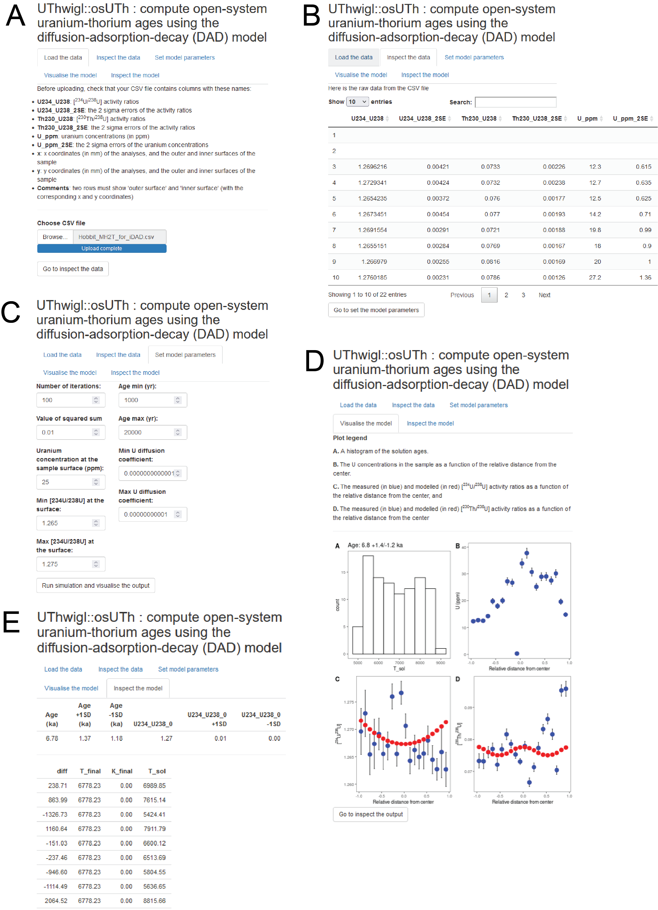
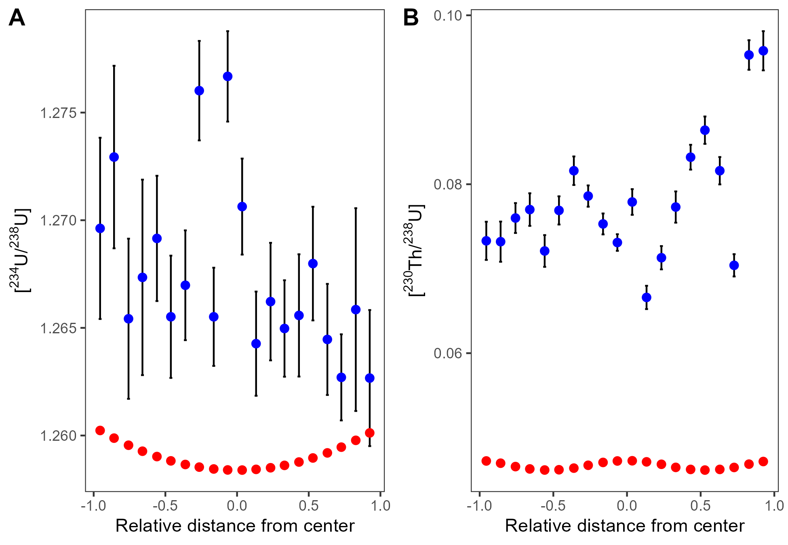
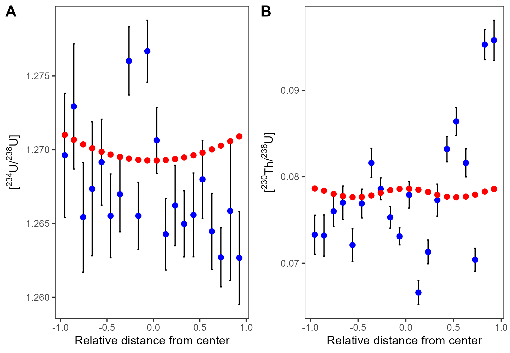
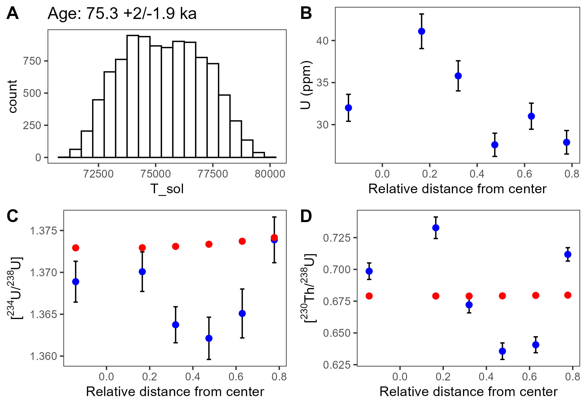

```{r setup, echo=FALSE, message=FALSE, warning = FALSE}
library(knitr)
opts_chunk$set(message = FALSE,
               warning = FALSE)

library(dplyr)
library(xtable)
```

\newpage
\linenumbers

# Introduction

Open-system uranium-thorium (U-Th) dating of teeth and bones, while challenging, has revolutionised our ability to provide reliable chronology for humans and fauna [@Eggins2005; @Gruen2014; @Sambridge2012]. Thus, this approach has significantly improved our understanding of human evolution [e.g. @Dirks2017; @Sutikna2016]. Uranium-thorium dating is based on the premise that a material takes up U but no Th, so all the ^230^Th in the sample comes from decay of ^238^U. If detrital Th is included to the sample, a correction must be included to account for the fraction of ^230^Th which is detrital and not derived from ^238^U decay. Another requirement is that there is no gain or loss of ^230^Th, ^234^U or ^238^U after formation of the material. While it is often the case for many geological samples such as corals or speleothems, this requirement is rarely met for teeth and bone (although enamel can sometimes be quite impervious to isotope gain or loss). Thus, for teeth and bone, U-Th dating requires to take into account open system behaviour. The diffusion-adsorption-decay (DAD) model developed by Sambridge et al. [-@Sambridge2012] was instrumental to implement successfully open-system U-Th dating. It allows for advective and diffusive transport of uranium and thorium isotopes, while include synchronous radioactive decay. The software implementation was written in Fortran and is available as a Java GUI (<http://www.iearth.org.au/codes/iDaD/>). In this article, we propose a R package which implements the model of Sambridge et al. [-@Sambridge2012].

The motivation for providing this model as an R package is to increase the transparency, reproducibility, and flexibility of the analytical workflow for computing U-Th ages. Currently it is difficult to include the Java GUI in a fully scripted data analysis so the method for computing the DAD model is not highly transparent. This can obscure steps where key decisions are made that are important for others to see to verify the reliability of the analysis. Enabling a scripted workflow for computational analysis of geoscience data is important for improving the reproducibiltiy of results. Reproducibility refers the ability to recreate the results or retest the hypotheses leading to a scientific claim, either by rerunning the same code used by the original authors, or by writing new code. High rates of irreproducibility of research results have been estimated in several fields and disciplines [@academy2015reproducibility; @freedman2015economics; @global2013case;  @ioannidis2005most; @open2015estimating; @camerer2018evaluating; @Camerer1433]. Consequently, the transparency, openness, and reproducibility of results and methods are receiving increased attention, and the norms of research in many fields are changing [@nosek2015promoting; @miguel2014promoting; @Marwick2016repro].

There is strong interest in open, transparent, and reusable research in the geoscience community [@Gil_et_al_2016] and substantial progress toward open data has been made in the geosciences with the widespread use of data services of NASA, USGS, NOAA and community-built data portals such as OneGeology, EarthChem, RRUFF, PANGAEA, PaleoBioDB, and others [@Kattge_Díaz_Wirth_2014; @ma2018data]. However, the use of open source software such as R [@Pebesma_Nust_Bivand_2012], and sharing of scripted data analysis workflows with research publications is not yet widespread [@Hutton_et_al_2016]. With this R package our goal is to make scripted and reproducible data analysis easy for open-system uranium-thorium dating. This will improve the transparency of geochronology research, and provide a more credible and robust foundation for scientific advancement [@Hutton_et_al_2016].

To enable re-use of our materials and improve reproducibility and transparency, all the results and visualisations in this paper can be reproduced using the RMarkdown vignette document included with the iDADwigl package. We have archived these files at <http://doi.org/10.17605/OSF.IO/D5P7S> to ensure long-term accessibility. Our code is released under the MIT licence, our data as CC-0, and our figures as CC-BY, to enable maximum re-use [for more details, see @Marwick2016repro].

# Methods

Data required for the DAD model are (^230^Th/^238^U) and (^234^U/^238^U) activity ratios collected along a transect perpendicular to the surface of the tooth or bone (brackets denote activity ratios throughout this article). Sampling for analysis can be done by micro-drilling or laser ablation. If the former, aliquots are then dissolved, followed by separation of U and Th using ion exchange chromatography. This is more time consuming (at least one week of work) than laser ablation, where the material sampled by the laser is directly sent to the mass spectrometer.

While laser ablation also offers a better spatial resolution than micro-drilling, the precision of the data is inferior because of the much smaller amount of material sampled. Uranium and thorium isotope ratios are then analysed by multi-collector inductively-coupled plasma mass spectrometry. A plasma ionise all U and Th atoms, their isotopes are separated through a magnetic field and each collected in a different collector. If using laser ablation, it is best to have two ion counters so ^230^Th and ^234^U can be collected simultaneously.

The distance of each analysis location from the inner and outer surfaces of the bones, for instance, needs to be recorded. One surface is given a coordinate of 1 and the other one -1, thus coordinates of analyses take values in between (Figure \@ref(fig:femurpic)).

(ref:femurpiccap) Modern human femur (132A/LB/27D/03) from Liang Bua, Flores, Indonesia. Two analysis transects can be seen. For a given transect, the outer and inner surface of the bone are given 1 and -1 reference coordinates, and the position of each analysis is calculated accordingly. Modified from Sutikna et al. [-@Sutikna2016]

```{r femurpic, out.width = "95%", fig.cap="(ref:femurpiccap)", echo = FALSE, eval = TRUE}
library(knitr)
include_graphics("figures/bone.png")
```

\FloatBarrier

# Working with the package

We provide three methods for using this package to suit different levels of familiarity with the R programming language. The simplest way to use the package is our web application (Figure \@ref(fig:shinyfig)).  Using the web application requires no familiarity with R. To use the web application you upload a CSV file, then click through a series of tabs to inspect the data, adjust the model parameters, run the model, and inspect the output. The interface is mouse-driven and requires no programming. In the web application you  upload the data file on the *Load the data* tab, set parameters from the *Set model parameters* tab, run the model by clicking the button *Run Simulation* on the same tab, and observe the results on the *Visualise the model* and *Inspect the model* tabs. You can change the parameters and re-run the model by click the button *Run Simulation*. Once done, close the window.

(ref:shinyfigcap) Screenshots of the web application for using the iDADwigl package. A: Upload a CSV file of the data to model, B: Inspect a table of the uploaded data. C: Set the model parameters and run the model. D: Inspect visualisations of the model's output. E: Inspect and download the numeric output from the model.

```{r shinyfig, out.width = "95%", fig.cap="(ref:shinyfigcap)", echo = FALSE, eval = TRUE}

```

The second way to use the package is with Binder, a browser-based instance of R and RStudio that includes our package ready to work with. Binder is a server technology that turns computational material, such as an R package, into interactive computational environments in the cloud. Using Binder requires a novice level of familiarity with R, for example to use the code in this paper and adapt it to work with a different CSV file. Because Binder provides a complete R environment, custom R code can be written during a Binder instance to further explore the model's output in the browser. These two methods, the web application and Binder, do not require any software to be downloaded and installedon your computer, all computation occurs in the browser. The web app and Binder are suitable for getting a quick start on working with the package, but they require a connnection to the internet, and they have limited memory and compute time available per instance. 

(ref:binderfigcap) Screenshot of Binder running R and RStudio in a web broswer window. 

```{r binderfig, out.width = "95%", fig.cap="(ref:binderfigcap)", echo = FALSE, eval = TRUE}
include_graphics("figures/binder.png")
```

The third method is to download and install the package locally to your computer, and work with it in your local installation of R and RStudio. This method requires some familiarity with R, but gives the most flexibility when working with the model because you are not limited by the memory and compute time of the cloud services. Our recommendation is to use Binder or a local installation of iDADwigl because then you can save an R script file that includes the name of the input file, the specific parameters used to generate the model output, and any downstream processing and visualisation. This script file and the CSV file can then be archived in a data repository to ensure long-term accessibility for other researchers. 

# Installing and attaching the package

First you will need to download and install [R](https://www.r-project.org/), and we also recommend downloading and installing [RStudio](https://www.rstudio.com/). To run the model, start `RStudio` and install the package from GitHub. There are many ways to do this, one simple method is shown in the line below. This only needs to be done once per computer.

```{r eval = FALSE}
source("https://install-github.me/tonydoss/iDADwigl")
```

For routine data analysis, R scripts need to contain the following line to attach the package to the current working envirovnment. This line needs to be run at the start of each analysis:

```{r}
# attach the package
library(iDADwigl)
```

Alternatively, the model can be run from your browser without installing R or RStudio with this [link](https://mybinder.org/v2/gh/benmarwick/iDADwigl/master?urlpath=rstudio).

\newpage

# Input data format

The key function of our package, `iDADwigl()` requires a data frame (a form of table in R) with the following column names:

- `iDAD.position`
- `U234_U238_CORR`
- `U234_U238_CORR_Int2SE`
- `iDAD.position.1`
- `Th230_U238_CORR`
- `Th230_U238_CORR_Int2SE`
- `U_ppm`
- `U_ppm_Int2SE`        

 To help with preparing data for input into our function, we have included two examples of input files. Inspecting the included data sets will be helpful for understanding how to prepare new data to prepare for use with this package. After attaching the package, we can access the built-in datasets with the `data()` function, like this:

```{r}
# access the data included in the iDADwigl package
data("Hobbit_1_1T_for_iDAD")
data("Hobbit_MH2T_for_iDAD")
```

This will make the built-in data available in the R environment to inspect and explore how to use the `iDADwigl()` function. 

To use new data with this package, we need to import a CSV or Excel file with the U-Th data into the R environment using a generic function such as `read.csv` or `read_excel` from the `readxl` package [@Wickham_readxl]. The code chunk below shows how to read one of the CSV files included in the package into the R environment. This is a good method to use if you supply your own CSV file to use with `iDADwigl()`. In this case we assume that the working directory contains a directory called `data` and our CSV file is in this `data` directory: 

```{r}
# read in one of the example CSV files included in the package
data_file <-
  read.csv('data/Hobbit_MH2T_for_iDAD.csv')
```

\newpage

Table \@ref(tab:hobbitone) shows the data contained in the `Hobbit_MH2T_for_iDAD.csv` file included in the package

```{r hobbitone, results="asis", echo = FALSE, eval=TRUE}
# inspect the data frame produced by importing the CSV file
options(xtable.floating = TRUE,
        xtable.comment = FALSE)

Hobbit_MH2T_for_iDAD_tbl <-
data_file %>%
  xtable(
         digits = c(1,3,3,3,3,3,3,1,1),
         caption = "\\label{tab:hobbitone}Data contained in the example CSV file Hobbit\\_MH2T\\_for\\_iDAD.csv included in the package")

align(Hobbit_MH2T_for_iDAD_tbl) <- rep("c", ncol(Hobbit_MH2T_for_iDAD_tbl) + 1)

print(Hobbit_MH2T_for_iDAD_tbl,
        method = 'compact',
        include.rownames = FALSE,
        rotate.colnames = TRUE)
```

The columns `iDAD.position`, `U234_U238_CORR`, `U234_U238_CORR_Int2SE`, `Th230_U238_CORR` and `Th230_U238_CORR_Int2SE` must be present in the input data frame with these exact names for the model to function. The `iDADwigl()` function will check if the input data frame has these columns, and will stop with an error message if it does not find these columns. The `names()` function can be used to update column names of a data frame to ensure they match the names that the model function requires. The order of the columns in the data frame is not important.

The `iDAD.position` column corresponds to the coordinates of the (^234^U/^238^U) analyses, which as indicated above take values between -1 and 1 (Figure \@ref(fig:femurpic)). The second `iDAD.position.1` column is used if the coordinates of the (^230^Th/^238^U) analyses are different from those of the (^234^U/^238^U) analyses.

Columns `U234_U238_CORR` and `U234_U238_CORR_Int2SE` are the (^234^U/^238^U) activity ratios and their 2$\sigma$ errors. Columns `Th230_U238_CORR` and
`Th230_U238_CORR_Int2SE` are the (^230^Th/^238^U) activity ratios and their 2$\sigma$ errors.

Columns `U_ppm` and `U_ppm_Int2SE` are the calculated uranium concentrations (in ppm) and their 2$\sigma$ errors. Uranium concentrations are not necessary for the model but needed to display the U concentration profile in a figure.

# Details of the input parameters

Our key function, `iDADwigl()` has several arguments that need to be set before we can get meaningful results.

`nbit` is the number of iterations. For the first run, set to 1.

`fsum_target` is the sum of the squared differences between the calculated and observed activity ratios. Give it a low value to start with (e.g. 0.01). If script takes too long, try a higher value for fsum_target.

`U48_0_min` and `U48_0_max` are the minimum and maximum values allowed for the (^234^U/^238^U) activity ratio at the surface of the sample. Since (^234^U/^238^U) does not vary greatly over the time period generally studied, the values measured near the surface of the sample can be used as a guide. These values can be adjusted if the model fit to the data is not optimal. For Hobbit_1-1T they are taken to be 1.360 and 1.375, and for Hobbit_MH2T, 1.265 and 1.270, respectively.

`l` is the thickness of the sample in centimeters. For Hobbit_1-1T it is 3.5 cm, for Hobbit_MH2T it is 5.35 cm

`U_0` is the uranium concentration at the surface in ppm. This value does not significantly affect the model results and values from analyses near either surface of the sample can be used as a guide. For Hobbit_1-1T it is taken to be 15 ppm; for Hobbit_MH2T, 25 ppm.

`K_min` and `K_max` are the minimum and maximum values allowed for the uranium diffusion coefficient (in cm^2^/s). Values between 10^-13^ and 10^-11^ cm^2^/s are generally appropriate.

`T_min` and `T_max` are the minimum and maximum values for the age of the specimen (yr). If there is no estimated knowledge of the sample age, the range of values can be 1,000 to 500,000 yr and adjusted later. For Hobbit_1-1T, in the final model run, they are taken to be 50,000 and 100,000 yr, and for Hobbit_MH2T, 1,000 and 20,000 yr, respectively.

After setting the `U480` maximum and minimum values, run the function and adjust these min and max values by looking at the calculated `U48_0_final`, `K_final`, and `T_final`. Adjust `T_min` and `T_max` using first estimates of the age. As you iterate, increase the `nbit` value to reduce the error.

\newpage

# How to run the model

Attach the package as shown above and then run `iDADwigl()`, specifying the input data frame and the input parameters as described above. The code block below shows a quick example that will execute in less than five seconds on a typical 2.3 GHz Intel Core i5 laptop:  

```{r model-output, results='hide'}
output <- iDADwigl(data_file,
                   nbit = 1000,
                   fsum_target = 0.01,
                   U48_0_min = 1.265,
                   U48_0_max = 1.270,
                   l = 5.35,
                   U_0 = 25,
                   K_min = 1e-13,
                   K_max = 1e-11,
                   T_min = 1e3,
                   T_max = 20e3,
                   with_plots = FALSE)
```

For efficient interactive use of this package, the default setting of `iDADwigl()` is to produce a panel plot as seen in Figure \@ref(fig:demopanelfig)(Figure \@ref(fig:demopanelfig). The setting `with_plots = FALSE` prevents plots from being generated which is more useful when the function is part of a longer sequence of code. The function runs faster when not producing pots, which is helpful when replicating many runs. 

When run on the R console, this function will print a confirmation that the input data frame has the required columns, and print the resulting age value with an error reported as the 67% and 33% quantiles, for instance:

```
All required columns are present in the input data
[1] "Age: 7 +0.6/-0.7 ka"
```

The model computes a Monte Carlo simulation where age of the sample, U diffusion coefficient and (^234^U/^238^U) ratio at the surface of the sample are taken randomly within the range of values allowed. Results are only kept if the calculated sum of the squared differences between the calculated and observed activity ratios is less than the value set in `fsum_target`. If this is the case, the calculated ratios and the set of solutions for age of the sample, U diffusion coefficient and (^234^U/^238^U) ratio at the surface of the sample are saved. The model stops once the number of sets of solutions reaches `nbit`.

The final calculated age `T_final` (in yr), U diffusion coefficient `K_final` (in cm^2^/s) and (^234^U/^238^U) ratio at the surface of the sample `U48_0_final` are the set of solutions where the solution age is the closest to the median age of the population of solutions. The uncertainty on each output paramter is calculated as the 67% and 33% quantiles of the population of solution sets.

In a typical analysis we will explore the model fit by first running the model with a single iteration `nbit` and a small value for `fsum_target`, and then changing the range of allowed values for the (^234^U/^238^U) ratio at the surface and the age of the sample. Once we obtain a satisfying fit (by visual inspection of the produced figures), we would increase `nbit` to a higher value (e.g. 1000) and run the model one last time. See below for an example of analysis.

\newpage

## Inspecting the model's output

`T_final`, `K_final` and `U48_0_final` are included in the model's output, along with their uncertainties. The function also includes a one-row data frame summarising the age:  

```{r outputresults, results="asis", echo = FALSE, eval=TRUE}
options(xtable.floating = TRUE,
        xtable.comment = FALSE)

output_results_table <-
output$results %>%
  xtable(
         digits = c(1,2,2,2,4,4,4),
         caption = "\\label{tab:outputresults}Summary table of the computed age and error values")

align(output_results_table) <- rep("c", ncol(output_results_table) + 1)

print(output_results_table,
      method = 'compact',
      include.rownames = FALSE,
      rotate.colnames = TRUE)
```

The last item in the output is a copy of the input data with two additional columns, the calculated activity ratios, (^234^U/^238^U) and (^230^Th/^238^U), for each measurement location on the sample.

```{r outputdata, results="asis", echo = FALSE, eval=TRUE}
options(xtable.floating = TRUE,
        xtable.comment = FALSE)

output_data_table <-
output$output_data %>%
  xtable(
         digits = c(1,3,3,3,3,3,3,1,1,3,3),
         caption = "\\label{tab:outputdata}Example of output table including the input data described above, and two new columns")

align(output_data_table) <- rep("c", ncol(output_data_table) + 1)

print(output_data_table,
      method = 'compact',
      include.rownames = FALSE,
      rotate.colnames = TRUE)
```

\newpage

## Visualising the model's output

`iDADwigl()` returns several figures useful for visualisation of the model results along with the data:

1.  a histogram of the solution ages (Figure \@ref(fig:demopanelfig) A)
2.  the U concentrations in the sample as a function of the relative distance from the center (Figure \@ref(fig:demopanelfig) B)
3.  the measured (in blue) and modelled (in red) (^234^U/^238^U) activity ratios as a function of the relative distance from the center (Figure \@ref(fig:demopanelfig) C), and
4. the measured (in blue) and modelled (in red) (^230^Th/^238^U) activity ratios as a function of the relative distance from the center (Figure \@ref(fig:demopanelfig) D).   


```{r tsol, echo=FALSE}
T_sol_plot <- T_sol_plot(output)
```

```{r Uconc, echo = FALSE}
# Uranium concentration profile for transect 2 of modern human femur 132A/LB/27D/03"
u_conc_t2_human_femur <- u_conc_profile_plot(output)
```

```{r U48, echo=FALSE}
# "Calculated (red) and observed (blue) (^234^U/^238^U) activity ratios for transect 2 of modern human femur 132A/LB/27D/03"
u234_u238_ratio_t2_human_femur <- u234_u238_ratio_plot(output)
```

```{r Th0U8, echo=FALSE}
# Calculated (red) and observed (blue) (^230^Th/^238^U) activity ratios for transect 2 of modern human femur 132A/LB/27D/03"
th230_u238_ratio_t2_human_femur <- th230_u238_ratio_plot(output)
```

```{r echo=FALSE, eval = T}
# combine plots
library(cowplot)
p1 <-
plot_grid(T_sol_plot,
          u_conc_t2_human_femur,
          u234_u238_ratio_t2_human_femur,
          th230_u238_ratio_t2_human_femur,
          labels = "AUTO",
          ncol = 2)
# save the plot, then use include_graphics to overcome an
# annoying latex error about 'Paragraph ended before \Gin@iii was complete.'
ggplot2::ggsave("figures/demo-panel-fig.png")
```

(ref:demopanelfigcap) Example of the visualisations produced by the `iDADwigl()` function, using the demonstration run described avove. A: Histogram of the solution ages, B: Uranium concentration profile for transect 2 of modern human femur 132A/LB/27D/03. C: Calculated (red) and observed (blue) (^234^U/^238^U) activity ratios for transect 2 of modern human femur 132A/LB/27D/03. D: Calculated (red) and observed (blue) (^230^Th/^238^U) activity ratios for transect 2 of modern human femur 132A/LB/27D/03.

```{r demopanelfig, out.width = "95%", fig.cap="(ref:demopanelfigcap)", echo = FALSE, eval = TRUE}
include_graphics("figures/demo-panel-fig.png")
```

\FloatBarrier

\newpage

# Case study of two ages from Sutikna et al. 2016

The package includes two sample data sets derived from @Sutikna2016 : "Hobbit_MH2T_for_iDAD.csv" is data from transect 2 for modern human femur 132A/LB/27D/03 (shown above in Table \@ref(tab:hobbitone)). "Hobbit_1-1T_for_iDAD.csv" is data from transect 1 for *Homo floresiensis* ulna LB1/52 (Table \@ref(tab:table-human)). For the latter, six analyses were removed from the set as in @Sutikna2016.

```{r table-human, results='asis', echo = FALSE, eval=TRUE}
options(xtable.floating = TRUE,
        xtable.comment = FALSE)

Hobbit_1_1T_for_iDAD_tbl <-
Hobbit_1_1T_for_iDAD %>%
  xtable(
         digits = c(1,3,3,3,3,3,3,1,1),
         caption = "\\label{tab:table-human}Data contained in the example CSV file Hobbit\\_1\\-1T\\_for\\_iDAD.csv included in the package")

align(Hobbit_1_1T_for_iDAD_tbl) <- rep("c", ncol(Hobbit_1_1T_for_iDAD_tbl) + 1)

print(Hobbit_1_1T_for_iDAD_tbl,
        method = 'compact',
        include.rownames = FALSE,
        rotate.colnames = TRUE)

```

## Age of the modern human remains from Sutikna et al. 2016

For transect 2 of 132A/LB/27D/03, Sutikna et al. [-@Sutikna2016] reported an age of 7.4 $\pm$ 0.5 ka (thousand years before 2014). With iDADwigl, we first run the model with `nbit` = 1, `fsum_target` = 0.05, `U48_0_min` and `U48_0_max` = 1.25 and 1.3, respectively, `l` = 5.35 cm, `U_0` = 25 ppm, `K_min` and `K_max` = 10^-13^ and 10^-11^ cm^2^/s, respectively, `T_min` and `T_max` = 10^3^ and 500x10^3^ yr, respectively. `U48_0_min` and `U48_0_max` are determined by considering the measured (^234^U/^238^U) values near the surfaces of the sample. `T_min` and `T_max` values were chosen such that no a priori knowledge of the age biases the results.

```{r first-run-modern-human, results='hide', echo=FALSE}
output_first_run_modern <- iDADwigl(Hobbit_MH2T_for_iDAD,
                   nbit = 1,
                   fsum_target = 0.05,
                   U48_0_min = 1.25,
                   U48_0_max = 1.3,
                   l = 5.35,
                   U_0 = 25,
                   K_min = 1e-13,
                   K_max = 1e-11,
                   T_min = 1e3,
                   T_max = 500e3,
                   with_plots = FALSE)
```

With this first run, we obtain an age of `r round(output_first_run_modern$T_final/1e3,1)` ka. There is no calculated error on the age since there is only one iteration. The calculated (^234^U/^238^U) and (^230^Th/^238^U) ratios can be quite different from observed values (Figure \@ref(fig:plot-panel-second-run-modern-fig)). For the (^234^U/^238^U), it makes sense to thus use a narrower range for `U48_0_min` and `U48_0_max`. Higher calculated (^230^Th/^238^U) ratios compared to observed values suggests that the calculated age is too old (since this ratio increases with age), and the opposite if the calculated (^230^Th/^238^U) ratios are too low. Thus, we should adjust `T_mix` and/or `T_max` accordingly.

```{r U48-first-run-modern-human, echo=FALSE}
# "Calculated (red) and observed (blue) (^234^U/^238^U) activity ratios for transect 2 of modern human femur 132A/LB/27D/03"
u234_u238_ratio_first_run_modern_human <- u234_u238_ratio_plot(output_first_run_modern)
```


```{r Th0U8-first-run-modern-human, echo=FALSE}
# Calculated (red) and observed (blue) (^230^Th/^238^U) activity ratios for transect 2 of modern human femur 132A/LB/27D/03"
th230_u238_ratio_first_run_modern_human <- th230_u238_ratio_plot(output_first_run_modern)
```

```{r plot-panel-first-run-modern, echo=FALSE}
library(cowplot)
# combine plots
p1 <-
plot_grid(u234_u238_ratio_first_run_modern_human,
          th230_u238_ratio_first_run_modern_human,
          labels = "AUTO",
          ncol = 2)

ggplot2::ggsave("figures/plot-panel-first-run-modern.png")
```

(ref:plot-panel-first-run-modern-cap) Results from the model's first run with the modern human femur. A: Calculated (red) and observed (blue) (^234^U/^238^U) activity ratios for transect 2 of modern human femur 132A/LB/27D/03. B: Calculated (red) and observed (blue) (^230^Th/^238^U) activity ratios for transect 2 of modern human femur 132A/LB/27D/03.

```{r plot-panel-first-run-modern-fig, echo=FALSE, out.width = "95%", fig.cap="(ref:plot-panel-first-run-modern-cap)"}

```

\FloatBarrier

```{r second-run-modern-human, results='hide', echo=FALSE}
output_second_run_modern <- iDADwigl(Hobbit_MH2T_for_iDAD,
                   nbit = 1000,
                   fsum_target = 0.05,
                   U48_0_min = 1.265,
                   U48_0_max = 1.270,
                   l = 5.35,
                   U_0 = 25,
                   K_min = 1e-13,
                   K_max = 1e-11,
                   T_min = 1e3,
                   T_max = 10e3,
                   with_plots = FALSE)
```

```{r U48-second-run-modern-human, echo=FALSE}
# "Calculated (red) and observed (blue) (^234^U/^238^U) activity ratios for transect 2 of modern human femur 132A/LB/27D/03"

u234_u238_ratio_second_run_modern_human <- u234_u238_ratio_plot(output_second_run_modern)   
```

```{r Th0U8-second-run-modern-human, echo=FALSE}
# Calculated (red) and observed (blue) (^230^Th/^238^U) activity ratios for transect 2 of modern human femur 132A/LB/27D/03"

th230_u238_ratio_second_run_modern_human <- th230_u238_ratio_plot(output_second_run_modern)   
```

```{r create-variables-to-quote-in-text-modern-human, echo=FALSE}
age <- round(output_second_run_modern$results$`Age (ka)`,1)
age_plus <- round(output_second_run_modern$results$`Age 67% quantile (ka)`,1)
age_minus <- round(output_second_run_modern$results$`Age 33% quantile (ka)`,1)
```

Since the first run suggests a Holocene age for the sample, the measured (^234^U/^238^U) at the surfaces must be similar to the calculated values, thus the chosen values for the range above. Once `U48_0_min`, `U48_0_min`, `T_min` and `T_max` parameters have been adjusted, the model is run again. `fsum_target` can also be decreased to 0.01 in order to get a better fit and error, but it is at the expense of computing time. This operation is repeated until a satisfying fit is obtained (by visual inspection of the figures). Finally, the moden is run once more, increasing the number of iterations to 1000 (or more). Following this method, we obtain an age of `r age` +`r age_plus`/-`r age_minus` ka (Figure \@ref(fig:plot-panel-second-run-modern-fig)).

```{r plot-panel-second-run-modern, echo=FALSE}
# combine plots
p1 <-
plot_grid(u234_u238_ratio_second_run_modern_human,
          th230_u238_ratio_second_run_modern_human,
          labels = "AUTO",
          ncol = 2)

ggplot2::ggsave("figures/plot-panel-second-run-modern.png")
```

(ref:plot-panel-second-run-modern-cap) Results from the model's second run with the modern human femur. A: Calculated (red) and observed (blue) (^234^U/^238^U) activity ratios for transect 2 of modern human femur 132A/LB/27D/03. B: Calculated (red) and observed (blue) (^230^Th/^238^U) activity ratios for transect 2 of modern human femur 132A/LB/27D/03.

```{r plot-panel-second-run-modern-fig, echo=FALSE, out.width = "100%", fig.cap="(ref:plot-panel-second-run-modern-cap)"}

```

\FloatBarrier

## Age of the *Homo floresiensis* remains from Sutikna et al. 2016

```{r model-output-hobbit, results='hide', echo=FALSE}
output_hobbit <- iDADwigl(Hobbit_1_1T_for_iDAD,
                   nbit = 1000,
                   fsum_target = 0.01,
                   U48_0_min = 1.360,
                   U48_0_max = 1.375,
                   l = 3.5,
                   U_0 = 15,
                   K_min = 1e-13,
                   K_max = 1e-11,
                   T_min = 50e3,
                   T_max = 100e3,
                   with_plots = FALSE)
```

```{r create-variables-to-quote-in-text-hobbit, echo=FALSE}
age <- round(output_hobbit$results$`Age (ka)`,1)
age_plus <- round(output_hobbit$results$`Age 67% quantile (ka)`,1)
age_minus <- round(output_hobbit$results$`Age 33% quantile (ka)`,1)
```

For transect 1 of LB1/52, Sutikna et al. [-@Sutikna2016] reported an age of 79.0 $\pm$ 3.7 ka. With iDADwigl, using data in the file `Hobbit_1-1T_for_iDAD.csv` provided in the package, and following the same method as above, we obtain an age of `r age` +`r age_plus`/-`r age_minus` ka (Figure \@ref(fig:plot-panel-hobbit-fig)). 

Note that results and errors will vary slightly for each run since populations are solution sets are randomly generated.

```{r tsol-hobbit, echo=FALSE}
library(ggplot2)
T_sol_plot_hobbit <-  T_sol_plot(output_hobbit)
```

```{r Uconc-hobbit, echo = FALSE}
# Uranium concentration profile for transect 1 of *Homo floresiensis* ulna LB1/52"
u_conc_hobbit <- u_conc_profile_plot(output_hobbit)
```

```{r U48-hobbit, echo=FALSE}
# "Calculated (red) and observed (blue) (^234^U/^238^U) activity ratios for transect 1 of *Homo floresiensis* ulna LB1/52"
u234_u238_ratio_hobbit <-  u234_u238_ratio_plot(output_hobbit)
```

```{r Th0U8-hobbit, echo=FALSE}
# Calculated (red) and observed (blue) (^230^Th/^238^U) activity ratios for transect 1 of *Homo floresiensis* ulna LB1/52"
th230_u238_ratio_hobbit <- th230_u238_ratio_plot(output_hobbit)
```

```{r plot-panel-hobbit-code,  echo=FALSE}
# combine plots
library(cowplot)
p2 <-
plot_grid(T_sol_plot_hobbit,
          u_conc_hobbit,
          u234_u238_ratio_hobbit,
          th230_u238_ratio_hobbit,
          labels = "AUTO",
          ncol = 2)

ggplot2::ggsave("figures/plot-panel-hobbit.png")
```

\newpage

(ref:plot-panel-hobbit-cap) Results from running the model with *Homo floresiensis* ulna LB1/52 data from @Sutikna2016. A: Histogram of the solution ages, B: Uranium concentration profile for transect 1 of *Homo floresiensis* ulna LB1/52. C: Calculated (red) and observed (blue) (^234^U/^238^U) activity ratios for transect 1 of *Homo floresiensis* ulna LB1/52. D: Calculated (red) and observed (blue) (^230^Th/^238^U) activity ratios for transect 1 of *Homo floresiensis* ulna LB1/52.

```{r plot-panel-hobbit-fig, echo=FALSE, out.width="95%", fig.cap="(ref:plot-panel-hobbit-cap)"}

```

\FloatBarrier

# Conclusions

In this paper we have described `iDADwigl`, an open source R package for computation of open-system U-Th ages. This helps to enable transparency, reproducibility, and flexibility of the analytical workflow for computing U-Th ages. The examples above show that results from our model are within error of previously published ages.

\newpage

\nolinenumbers

# References {#references .unnumbered}

<div id="refs"></div>

\newpage

### Colophon

This report was generated on `r Sys.time()` using the following computational environment and dependencies:

```{r colophon, cache = FALSE}
# which R packages and versions?
devtools::session_info()
```

The current Git commit details are:

```{r}
git2r::repository(here::here())
```
