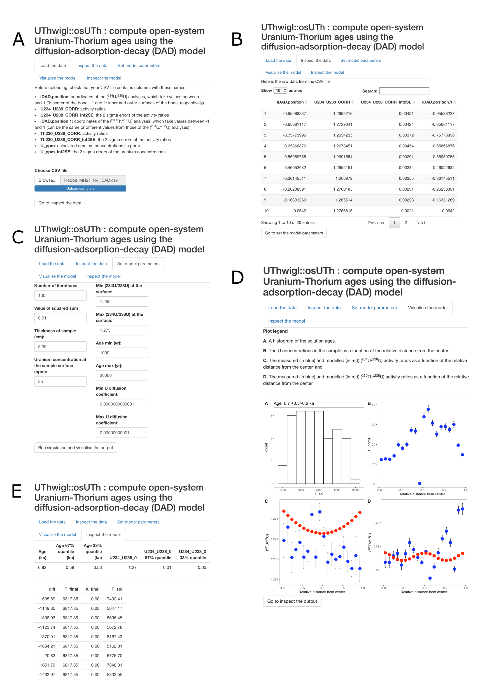
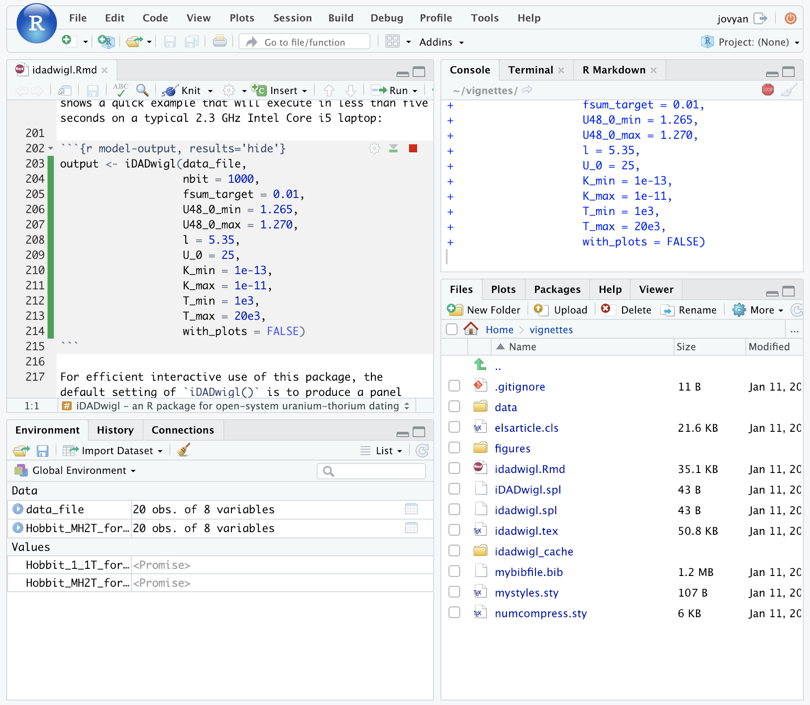
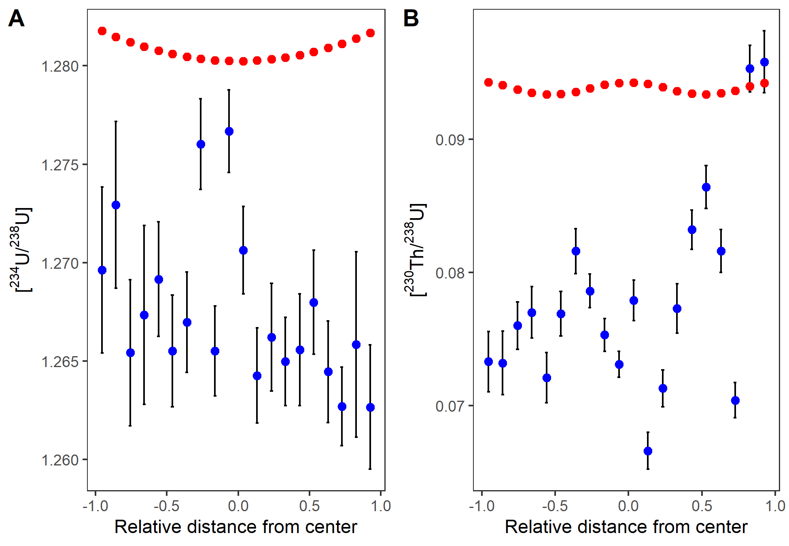
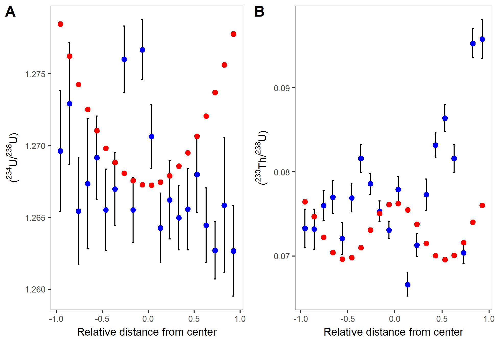
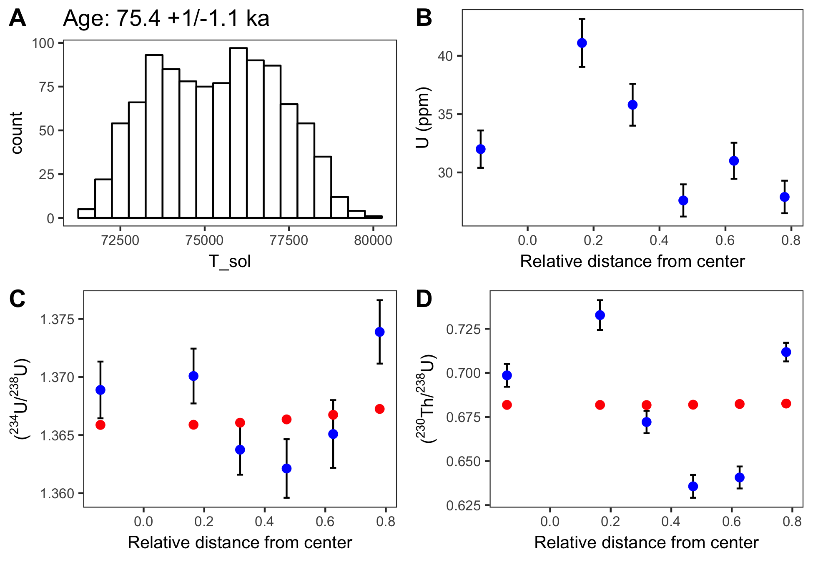

```{r setup, echo=FALSE, message=FALSE, warning = FALSE}
library(knitr)
opts_chunk$set(message = FALSE,
               warning = FALSE)

library(dplyr)
library(xtable)
library(ggplot2)
```

\newpage
\linenumbers

# Introduction

Uranium-thoriumg (U-Th) dating has revolutionised Quaternary science and archaeology. Dating uses the decay of ^238^U into ^230^Th, with ^234^U and a few short-lived nuclides as intermediary products. It is based on the principle that the age of formation of a material can be dated as it incorporates U and no or little Th at the time of formation, so all the ^230^Th in the sample comes from decay of ^238^U. If detrital Th is included to the sample, a correction must be included to account for the fraction of ^230^Th which is detrital and not derived from ^238^U decay. Another requirement is that there is no gain or loss of ^230^Th, ^234^U or ^238^U after formation of the material (*closed system*).

Closed-system U-Th dating has been successfully applied to a range of carbonates, from corals [@RN4495] to speleothems [@RN4494]. In corals and most speleothems, detrital correction is minimal; however, it can be significant when dating pedogenic carbonates, for instance [@RN801]. In this case, detrital correction can be performed using the measured or assumed composition of the detrital fraction [e.g. @RN4370]. Alternatively, isochron techniques can be applied [@RN2155]; the latter are beyond the scope of this article but IsoPlot is a commonly used software for isochron calculations and other geochronological applications [@RN2163].

Closed-system conditions are seldom met in teeth and bones (although enamel can sometimes be quite impervious to isotope gain or loss). Thus, for teeth and bone, U-Th dating requires to take into account open system behaviour. The diffusion-adsorption-decay (DAD) model developed by Sambridge et al. [-@Sambridge2012] was instrumental to implement successfully open-system U-Th dating. It allows for advective and diffusive transport of uranium and thorium isotopes, while include synchronous radioactive decay. The software implementation was written in Fortran and is available as a Java GUI (<http://www.iearth.org.au/codes/iDaD/>).  

Open-system U-Th dating of teeth and bones, while challenging, has provided quantitative ages for human and faunal remains [@Eggins2005; @Gruen2014; @Sambridge2012]. Thus, this approach has significantly improved our understanding of human evolution [e.g. @Dirks2017; @Sutikna2016]. 

In this article, we propose a R package which offers functions to perform closed-system, `csUTh()`, and open-system, `osUTh()`, U-Th age calculations. The former implements formulations given in Ludwig [-@RN4370] while the latter applies the Diffusion-Adsorption-Decay (DAD) model of Sambridge et al. [-@Sambridge2012].
The motivation for providing an R package is to increase the transparency, reproducibility, and flexibility of the analytical workflow for computing U-Th ages. For instance, with open-system dating, it is difficult to include the Java GUI in a fully scripted data analysis so the method for computing the DAD model is not highly transparent. This can obscure steps where key decisions are made that are important for others to see to verify the reliability of the analysis. Enabling a scripted workflow for computational analysis of geoscience data is important for improving the reproducibiltiy of results. Reproducibility refers the ability to recreate the results or retest the hypotheses leading to a scientific claim, either by rerunning the same code used by the original authors, or by writing new code. High rates of irreproducibility of research results have been estimated in several fields and disciplines [@academy2015reproducibility; @freedman2015economics; @global2013case;  @ioannidis2005most; @open2015estimating; @camerer2018evaluating; @Camerer1433]. Consequently, the transparency, openness, and reproducibility of results and methods are receiving increased attention, and the norms of research in many fields are changing [@nosek2015promoting; @miguel2014promoting; @Marwick2016repro].

There is strong interest in open, transparent, and reusable research in the geoscience community [@Gil_et_al_2016] and substantial progress toward open data has been made in the geosciences with the widespread use of data services of NASA, USGS, NOAA and community-built data portals such as OneGeology, EarthChem, RRUFF, PANGAEA, PaleoBioDB, and others [@Kattge_Diaz_Wirth_2014; @ma2018data]. However, the use of open source software such as R [@Pebesma_Nust_Bivand_2012], and sharing of scripted data analysis workflows with research publications is not yet widespread [@Hutton_et_al_2016]. With this R package our goal is to make scripted and reproducible data analysis easy for open-system uranium-thorium dating. This will improve the transparency of geochronology research, and provide a more credible and robust foundation for scientific advancement [@Hutton_et_al_2016].

To enable re-use of our materials and improve reproducibility and transparency, all the results and visualisations in this paper can be reproduced using the RMarkdown vignette document included with the UThwigl package. We have archived these files at <http://doi.org/10.17605/OSF.IO/D5P7S> to ensure long-term accessibility. Our code is released under the MIT licence, our data as CC-0, and our figures as CC-BY, to enable maximum re-use [for more details, see @Marwick2016repro].

# Methods

For U-Th dating, two types of analysis are possible: bulk or in-situ. For bulk analysis, a fraction of the samples is dissolved and the solution processed through ion exchange chromatography to separate U and Th [e.g. @RN2951]. Each element is then analysed separately for their isotope ratios by mass spectrometry.
For in-situ analysis, laser ablation is commonly used [@Eggins2005]. In this case, a laser with a spot size ranging from a few \(\mu m\) to several hundreds of \(\mu m\) produces an aerosol which is carried using a gas (helium or preferably a mixture of helium and nitrogen; @RN2257).
While laser ablation offers a better spatial resolution and is less time consuming than bulk analysis, the precision of the data is inferior because of the much smaller amount of material sampled. 

Uranium and thorium isotope ratios are then analysed by multi-collector inductively-coupled plasma mass spectrometry (e.g. @RN2951; although bulk analysis can also be performed by thermal ionisation mass spectrometry). A plasma ionise U and Th atoms, their isotopes are separated through a magnetic field and each collected in a different collector. If using laser ablation, it is best to have two ion counters so ^230^Th and ^234^U can be collected simultaneously.

## Closed-system dating

Pending closed-system behaviour can be assessed, it is possible to derive an age for each U-Th analysis.
The closed-system function `csUTh()` requires that for each analysis to yield an age, (^234^U/^238^U), (^230^Th/^238^U) and (^232^Th/^238^U) activity ratios are measured (parentheses denote activity ratios throughout this article). The (^232^Th/^238^U) activity ratio is required for detrital correction (note it is needed to use `csUTh()` whether the detrital correction is performed or not).

## Open-system dating

Data required for the DAD model are (^230^Th/^238^U) and (^234^U/^238^U) activity ratios collected along a transect perpendicular to the surface of the tooth or bone. Sampling for analysis can be done by micro-drilling or laser ablation. 

The distance of each analysis location from the inner and outer surfaces of the bones, for instance, needs to be recorded. One surface is given a coordinate of 1 and the other one -1, thus coordinates of analyses take values in between (Figure \@ref(fig:femurpic)).

(ref:femurpiccap) Modern human femur (132A/LB/27D/03) from Liang Bua, Flores, Indonesia. Two analysis transects can be seen. For a given transect, the outer and inner surface of the bone are given 1 and -1 reference coordinates, and the position of each analysis is calculated accordingly. Modified from Sutikna et al. [-@Sutikna2016].


```{r femurpic, out.width = "95%", fig.cap="(ref:femurpiccap)", echo = FALSE, eval = TRUE}
include_graphics("figures/bone.png")
```

\FloatBarrier

# Working with the package

We provide three methods for using this package to suit different levels of familiarity with the R programming language. The simplest way to use the package is our web application (Figure \@ref(fig:shinyfig)). Using the web application requires no familiarity with R. To use the web application we upload a CSV file, then click through a series of tabs to inspect the data, adjust the model parameters, run the model, and inspect the output. The interface is mouse-driven and requires no programming. In the web application we upload the data file on the *Load the data* tab, set parameters from the *Set model parameters* tab, run the model by clicking the button *Run Simulation* on the same tab, and observe the results on the *Visualise the model* and *Inspect the model* tabs. We can change the parameters and re-run the model by click the button *Run Simulation*. Once done, close the window.

(ref:shinyfigcap) Screenshots of the web application for using the UThwigl package. A: Upload a CSV file of the data to model, B: Inspect a table of the uploaded data. C: Set the model parameters and run the model. D: Inspect visualisations of the model's output. E: Inspect and download the numeric output from the model.

```{r shinyfig, out.width = "95%", fig.cap="(ref:shinyfigcap)", echo = FALSE, eval = TRUE}

```

The second way to use the package is with Binder, a browser-based instance of R and RStudio that includes our package ready to work with. Binder is a server technology that turns computational material, such as an R package, into interactive computational environments in the cloud. Using Binder requires a novice level of familiarity with R, for example to use the code in this paper and adapt it to work with a different CSV file. Because Binder provides a complete R environment, custom R code can be written during a Binder instance to further explore the model's output in the browser. These two methods, the web application and Binder, do not require any software to be downloaded and installed on the user's computer, all computation occurs in the browser. The web application and Binder are suitable for getting a quick start on working with the package, but they require a connnection to the internet, and they have limited memory and compute time available per instance. 

(ref:binderfigcap) Screenshot of Binder running R and RStudio in a web browser window. 

```{r binderfig, out.width = "95%", fig.cap="(ref:binderfigcap)", echo = FALSE, eval = T}

```
The third method is to download and install the package locally to the user's computer, and work with it in the user's local installation of R and RStudio. This method requires some familiarity with R, but gives the most flexibility when working with the model because we are not limited by the memory and compute time of the cloud services. Our recommendation is to use Binder or a local installation of UThwigl because then the user can save an R script file that includes the name of the input file, the specific parameters used to generate the model output, and any downstream processing and visualisation. This script file and the CSV file can then be archived in a data repository to ensure long-term accessibility for other researchers. In the following sections we demonstrate the use of UThwigl with a local installation of R and RStudio. 

# Installing and attaching the package

First the user will need to download and install [R](https://www.r-project.org/), and we also recommend downloading and installing [RStudio](https://www.rstudio.com/). To run the model, start `RStudio` and install the package from GitHub. There are many ways to do this, one simple method is shown in the line below. This only needs to be done once per computer.

```{r eval = FALSE}
source("https://install-github.me/tonydoss/UThwigl")
```

For routine data analysis, R scripts need to contain the following line to attach the package to the current working environnment. This line needs to be run at the start of each analysis:

```{r}
# attach the package
library(UThwigl)
```

\newpage

# Closed-system U-Th dating

## Input data format

Our package provides the fuction `csUTh()` for closed-system U-Th dating. Data for this function needs to be in a data frame (a form of table in R) with the following column names:

- `Sample_ID`
- `U234_U238_CORR`
- `U234_U238_CORR_Int2SE`
- `Th230_U238_CORR`
- `Th230_U238_CORR_Int2SE`
- `Th232_U238_CORR`
- `Th232_U238_CORR_Int2SE`

 To help with preparing data for input into our function, we have included an example of an input file, taken from Pan et al. [-@RN5108]. Inspecting the included data sets will be helpful for understanding how to prepare new data to prepare for use with this package. After attaching the package, we can access the built-in datasets with the `data()` function, like this:

```{r}
# access the data included in the UThwigl package
data("Pan2018")
```

This will make the built-in data available in the R environment to inspect and explore how to use the `csUTh()` function. To use new data with this package, the user needs to import a CSV or Excel file with the U-Th data into the R environment. This can be done using a generic function such as `read.csv` or `read_excel` from the `readxl` package [@Wickham_readxl]. Before reading in the data file, the user needs to set the working directory to the folder containing the data file. This can be done in RStudio using the menu item 'Session' > 'Set Working Directory' > 'To Source File Location'. Alternatively, the working directory can be defined interactively at the R prompt in the Console panel useing `setwd()`. However, we do not recommend including `setwd()` in script files because it is bad for reproducibility, since the path to one user's working directory will not exist on another user's computer.  

To download the built-in data to the user's computer so it can be inspected and modified in a spreadsheet program, use `write.csv()`

```{r eval = FALSE}
# download the data included in the package
write.csv(Pan2018, "Pan2018.csv")
```

The code chunk below shows how to read one of the CSV files included in the package into the R environment. We assume that the user's working directory contains a directory called `data` and the CSV file is in this `data` directory, and so the data can be imported as follows: 

```{r, eval = TRUE, echo=TRUE}
# read in one of the example CSV files included in the package
input_data_cs <-
  read.csv('data/Pan2018.csv')
```

Table \@ref(tab:pan) shows the data contained in the `Pan2018.csv` file included in the package.

```{r pan, results="asis", echo = FALSE, eval=TRUE}
# inspect the data frame produced by importing the CSV file
options(xtable.floating = TRUE,
        xtable.comment = FALSE)

Pan2018_tbl <-
input_data_cs %>%
  xtable(
         digits = c(1,3,3,3,3,3,3, 5),
         caption = "\\label{tab:pan}Data contained in the example CSV file Pan2018.csv included in the package")

align(Pan2018_tbl) <- rep("c", ncol(Pan2018_tbl) + 1)

print(Pan2018_tbl,
        method = 'compact',
        include.rownames = FALSE,
        rotate.colnames = TRUE)
```

The columns `Sample_ID`, `U234_U238_CORR`, `U234_U238_CORR_Int2SE`, `Th230_U238_CORR`,  `Th230_U238_CORR_Int2SE`, `Th232_U238_CORR` and `Th232_U238_CORR_Int2SE` must be present in the input data frame with these exact names for the model to function. The `csUTh()` function will check if the input data frame has these columns, and will stop with an error message if it does not find these columns. The `names()` function can be used to update column names of a data frame to ensure they match the names that the model function requires. Alteratively the user can edit the column names in a spreadsheet program such as Microsoft Excel. The order of the columns in the data frame is not important.

Columns `U234_U238_CORR` and `U234_U238_CORR_Int2SE` are the (^234^U/^238^U) activity ratios and their 2$\sigma$ errors. Columns `Th230_U238_CORR` and `Th230_U238_CORR_Int2SE` are the (^230^Th/^238^U) activity ratios and their 2$\sigma$ errors. Columns `Th232_U238_CORR` and `Th232_U238_CORR_Int2SE` are the (^232^Th/^238^U) activity ratios and their 2$\sigma$ errors.

### Details of the input parameters of closed-system analysis 

`sample_name` is the name of the sample to calculate closed-system ages for. The function will partially match by sample prefix.  For example in Table \@ref(tab:pan) one sample is indicated by the Sample ID 'YP003'. If the user inputs 'YP003' for the `sample_name`, then this will match rows where the Sample ID is 'YP003-1', 'YP003-2', 'YP003-3', and so on.   
 
`nbitchoice` is the number of iterations in the model. Recommended to have at least 100.
`detcorrectionchoice` is a parameter for chosing whether or not to apply a detrital correction to the calculation. 

`R28det` (0.8) and `R28det_err` (0.08) are the values for the (^232^Th/^238^U) activity ratio of the detritus and its standard error (default values in parentheses). Similarly, `R08det` (1) and `R08det_err` (0.05) are the values for the (^230^Th/^238^U) activity ratio of the detritus and its standard error, and `R48det` (1) and `R48det_err` (0.02) are the corresponding values for (^234^U/^238^U) activity ratio of the detritus.

## How to run the model

Assuming that the package is attached with `library(UThwigl)`, as shown above, and the data have been imported to the working environment as noted above, run `csUTh()`, specifying the input data frame and the input parameters as described above. The code block below shows a typical example that will execute in less than five seconds on a typical 2.3 GHz Intel Core i5 laptop:  

```{r cs-model-output, results='hide'}
# Solve for sample YP003 in-situ analyses
output_cs <-
  csUTh(
    input_data_cs,
    sample_name = 'YP003',
    nbitchoice = 100,
    detcorrectionchoice = TRUE,
    keepfiltereddata = FALSE,
    print_summary = TRUE,
    with_plots = TRUE,
    save_plots = TRUE,
    save_output = TRUE
  )
```

For efficient interactive use of this package, the default setting of `csUTh()` is to produce a panel plot as seen in Figure \@ref(fig:csuthvizfig). The setting `with_plots = FALSE` prevents plots from being generated which is more useful when the function is part of a longer sequence of code. The function runs faster when not producing pots, which is helpful when replicating many runs. The setting `save_output = TRUE` will save a csv file to the current working directory so the output data can be used in other contexts. The csv file that is created when `save_output = TRUE` will be given a name that includes a date and time stamp so that the output of each time the function is run can be saved to a unique file. 

When run on the R console, this function will print a confirmation that the input data frame has the required columns. If `print_summary` is set to `TRUE`, it will also the resulting mean age value of several analyses on a single sample, with an error reported as 2 Standard Error, for example:

```
All required columns are present in the input data
[1] "Mean age:  117.1 +/- 3.7  ka"
```

`print_summary` should be set to `FALSE` if ages computed are not for analyses of the same sample, since this mean age would be meaningless. 

## Inspecting and visualizing the models' output

The function returns a data frame with the age, error and summary output for each measurement, as shown in Table \@ref(tab:panoutput). This includes calculated ages (with or without detrital correction, depending how `detcorrectionchoice` was set), initial (^234^U/^238^U) activity ratios, along with their uncertainties.


```{r panoutput, results="asis", echo = FALSE, eval=TRUE}
# inspect the data frame produced by importing the CSV file
options(xtable.floating = TRUE,
        xtable.comment = FALSE)

cs_output_tbl <-
output_cs$results %>%
  xtable(
         digits = c(1,3,3,4,4,4),
         caption = "\\label{tab:panoutput}Output produced by the csUTh function used with data from Pan et al. 2018")

align(cs_output_tbl) <- rep("c", ncol(cs_output_tbl) + 1)

print(cs_output_tbl,
        method = 'compact',
        include.rownames = FALSE,
        rotate.colnames = TRUE)
```

The plots produced by the `csUTh()` function are stored as list objects in the output from the function. We can show the plots by accessing the list like this: 

(ref:csuthvizfigcap) Example of the visualisations produced by the `csUTh()` function, using the demonstration run described above, and five in-situ analyses  by laser ablation of coral sample YP003. A: closed-system ages and B: initial (^234^U/^238^U) activity ratios for each sample analysis

```{r csuthvizfig, out.width = "95%", fig.cap="(ref:csuthvizfigcap)", echo = T, eval = TRUE}
output_cs$plots
```

\FloatBarrier

\newpage

# Open-system U-Th dating
## Input data format

For open-system U-Th dating we provide the function `osUTh()`, which requires a data frame with the following column names:

- `iDAD.position`
- `U234_U238_CORR`
- `U234_U238_CORR_Int2SE`
- `iDAD.position.1`
- `Th230_U238_CORR`
- `Th230_U238_CORR_Int2SE`
- `U_ppm`
- `U_ppm_Int2SE`        

We have included two examples of input files. After attaching the package, we can access the built-in datasets with the `data()` function, like this:

```{r}
# access the data included in the UThwigl package
data("Hobbit_1_1T_for_iDAD")
data("Hobbit_MH2T_for_iDAD")
```

As above, these datasets can be downloaded from the package with `write.csv()`:

```{r eval = FALSE}
# download the data included in the package
write.csv(Hobbit_1_1T_for_iDAD, "Hobbit_1_1T_for_iDAD.csv")
write.csv(Hobbit_MH2T_for_iDAD, "HHobbit_MH2T_for_iDADcsv")
```

The code chunk below shows how to read one of the CSV files included in the package into the R environment. As above, we assume that the user's working directory contains a directory called `data` and the CSV file is in this `data` directory, and so the data can be imported as follows: 

```{r, eval = TRUE, echo=TRUE}
# read in one of the example CSV files included in the package
input_data_os <-
  read.csv('data/Hobbit_MH2T_for_iDAD.csv')
```

\newpage

Table \@ref(tab:hobbitone) shows the data contained in the `Hobbit_MH2T_for_iDAD.csv` file included in the package

```{r hobbitone, results="asis", echo = FALSE, eval=TRUE}
# inspect the data frame produced by importing the CSV file
options(xtable.floating = TRUE,
        xtable.comment = FALSE)

Hobbit_MH2T_for_iDAD_tbl <-
input_data_os %>%
  xtable(
         digits = c(1,3,3,3,3,3,3,1,1),
         caption = "\\label{tab:hobbitone}Data contained in the example CSV file Hobbit\\_MH2T\\_for\\_iDAD.csv included in the package")

align(Hobbit_MH2T_for_iDAD_tbl) <- rep("c", ncol(Hobbit_MH2T_for_iDAD_tbl) + 1)

print(Hobbit_MH2T_for_iDAD_tbl,
        method = 'compact',
        include.rownames = FALSE,
        rotate.colnames = TRUE)
```

As for the closed-system function, the columns `iDAD.position`, `U234_U238_CORR`, `U234_U238_CORR_Int2SE`, `Th230_U238_CORR` and `Th230_U238_CORR_Int2SE` must be present in the input data frame with these exact names for the model to function. The `osUTh()` function will check if the input data frame has these columns, and will stop with an error message if it does not find these columns.

The `iDAD.position` column corresponds to the coordinates of the (^234^U/^238^U) analyses, which as indicated above take values between -1 and 1 (Figure \@ref(fig:femurpic)). The second `iDAD.position.1` column is used if the coordinates of the (^230^Th/^238^U) analyses are different from those of the (^234^U/^238^U) analyses.

Columns `U_ppm` and `U_ppm_Int2SE` are the calculated uranium concentrations (in ppm) and their 2$\sigma$ errors. Uranium concentrations are not necessary for the model but needed to display the U concentration profile in a figure.

### Details of the input parameters of open-system analysis 

Our key function, `osUTh()` has several arguments that need to be set before meaningful results can be obtained:

`nbit` is the number of iterations. For the first run, set to 1.

`fsum_target` is the sum of the squared differences between the calculated and observed activity ratios. Give it a low value to start with (e.g. 0.01). If script takes too long, try a higher value for fsum_target.

`U48_0_min` and `U48_0_max` are the minimum and maximum values allowed for the (^234^U/^238^U) activity ratio at the surface of the sample. Since (^234^U/^238^U) does not vary greatly over the time period generally studied, the values measured near the surface of the sample can be used as a guide. These values can be adjusted if the model fit to the data is not optimal. For Hobbit_1-1T they are taken to be 1.360 and 1.375, and for Hobbit_MH2T, 1.265 and 1.270, respectively.

`l` is the thickness of the sample in centimeters. For Hobbit_1-1T it is 3.5 cm, for Hobbit_MH2T it is 5.35 cm

`U_0` is the uranium concentration at the surface in ppm. This value does not significantly affect the model results and values from analyses near either surface of the sample can be used as a guide. For Hobbit_1-1T it is taken to be 15 ppm; for Hobbit_MH2T, 25 ppm.

`K_min` and `K_max` are the minimum and maximum values allowed for the uranium diffusion coefficient (in cm^2^/s). Values between 10^-13^ and 10^-11^ cm^2^/s are generally appropriate.

`T_min` and `T_max` are the minimum and maximum values for the age of the specimen (yr). If there is no estimated knowledge of the sample age, the range of values can be 1,000 to 500,000 yr and adjusted later. For Hobbit_1-1T, in the final model run, they are taken to be 50,000 and 100,000 yr, and for Hobbit_MH2T, 1,000 and 20,000 yr, respectively.

After setting the `U480` maximum and minimum values, run the function and adjust these min and max values by looking at the calculated `U48_0_final`, `K_final`, and `T_final`. Adjust `T_min` and `T_max` using first estimates of the age. As we iterate, increase the `nbit` value to reduce the error.


## How to run the model

Attach the package as shown above and then run `osUTh()`, specifying the input data frame and the input parameters as described above. The code block below shows a quick example that will execute in less than five seconds on a typical 2.3 GHz Intel Core i5 laptop:  

```{r model-output, results='hide'}
output_os <- osUTh(input_data_os,
                   nbit = 1000,
                   fsum_target = 0.01,
                   U48_0_min = 1.265,
                   U48_0_max = 1.270,
                   l = 5.35,
                   U_0 = 25,
                   K_min = 1e-13,
                   K_max = 1e-11,
                   T_min = 1e3,
                   T_max = 20e3,
                   with_plots = TRUE,
                   save_plots = TRUE,
                   save_output = TRUE)
```

The default setting of `osUTh()` is to produce a panel plot as seen in Figure \@ref(fig:demopanelfig)(Figure \@ref(fig:demopanelfig). The setting `with_plots = FALSE` prevents plots from being generated which is more useful when the function is part of a longer sequence of code. The function runs faster when not producing pots, which is helpful when replicating many runs. 

Similar to the `csUTh()` function, when `osUTh()` is run on the R console, it will print a confirmation that the input data frame has the required columns, and print the resulting age value with an error reported as the 67% and 33% quantiles, for example:

```
All required columns are present in the input data
[1] "Age: 7 +0.6/-0.7 ka"
```

The model computes a Monte Carlo simulation where age of the sample, U diffusion coefficient and (^234^U/^238^U) ratio at the surface of the sample are taken randomly within the range of values allowed. Results are only kept if the calculated sum of the squared differences between the calculated and observed activity ratios is less than the value set in `fsum_target`. If this is the case, the calculated ratios and the set of solutions for age of the sample, U diffusion coefficient and (^234^U/^238^U) ratio at the surface of the sample are saved. The model stops once the number of sets of solutions reaches `nbit`.

The final calculated age `T_final` (in yr), U diffusion coefficient `K_final` (in cm^2^/s) and (^234^U/^238^U) ratio at the surface of the sample `U48_0_final` are the set of solutions where the solution age is the closest to the median age of the population of solutions. The uncertainty on each output paramter is calculated as the 67% and 33% quantiles of the population of solution sets.

In a typical analysis the user will explore the model fit by first running the model with a single iteration `nbit` and a small value for `fsum_target`, and then changing the range of allowed values for the (^234^U/^238^U) ratio at the surface and the age of the sample. Once the user has obtained a satisfying fit (by visual inspection of the produced figures), they would increase `nbit` to a higher value (e.g. 1000) and run the model one last time. We provide an example of a typical analysis analysis below.

## Inspecting the models' output

`T_final`, `K_final` and `U48_0_final` are included in the model's output, along with their uncertainties. The function also includes a one-row data frame summarising the age:  

```{r outputresults, results="asis", echo = FALSE, eval=TRUE}
options(xtable.floating = TRUE,
        xtable.comment = FALSE)

output_results_table <-
output_os$results %>%
  xtable(
         digits = c(1,2,2,2,4,4,4),
         caption = "\\label{tab:outputresults}Summary table of the computed age and error values")

align(output_results_table) <- rep("c", ncol(output_results_table) + 1)

print(output_results_table,
      method = 'compact',
      include.rownames = FALSE,
      rotate.colnames = TRUE)
```

The last item in the output is a copy of the input data with two additional columns, the calculated activity ratios, (^234^U/^238^U) and (^230^Th/^238^U), for each measurement location on the sample.

```{r outputdata, results="asis", echo = FALSE, eval=TRUE}
options(xtable.floating = TRUE,
        xtable.comment = FALSE)

output_data_table <-
output_os$output_data %>%
  xtable(
         digits = c(1,3,3,3,3,3,3,1,1,3,3),
         caption = "\\label{tab:outputdata}Example of output table including the input data described above, and two new columns")

align(output_data_table) <- rep("c", ncol(output_data_table) + 1)

print(output_data_table,
      method = 'compact',
      include.rownames = FALSE,
      rotate.colnames = TRUE)
```


## Visualising the models' output

`osUTh()` returns several figures useful for visualisation of the model results along with the data:

1.  a histogram of the solution ages (Figure \@ref(fig:demopanelfig) A)
2.  the U concentrations in the sample as a function of the relative distance from the center (Figure \@ref(fig:demopanelfig) B)
3.  the measured (in blue) and modelled (in red) (^234^U/^238^U) activity ratios as a function of the relative distance from the center (Figure \@ref(fig:demopanelfig) C), and
4. the measured (in blue) and modelled (in red) (^230^Th/^238^U) activity ratios as a function of the relative distance from the center (Figure \@ref(fig:demopanelfig) D).   

We can show the plots produced by `osUTh()` by accessing the list like this: 

(ref:demopanelfigcap) Example of the visualisations produced by the `osUTh()` function, using the demonstration run described avove. A: Histogram of the solution ages, B: Uranium concentration profile for transect 2 of modern human femur 132A/LB/27D/03. C: Calculated (red) and observed (blue) (^234^U/^238^U) activity ratios for transect 2 of modern human femur 132A/LB/27D/03. D: Calculated (red) and observed (blue) (^230^Th/^238^U) activity ratios for transect 2 of modern human femur 132A/LB/27D/03.

```{r demopanelfig, out.width = "95%", fig.cap="(ref:demopanelfigcap)", echo = TRUE, eval = TRUE}
output_os$plots
```

\FloatBarrier

\newpage

# Case studies

## Closed-system dating - Case study from Pan et al. 2018

The package includes sample data from Marine Isotope Stage 5 corals from @RN5108 (Table \@ref(tab:pan)). Two *Plesiastrea versipora* coral samples were analysed: YP002 and YP003. The first two rows in Table \@ref(tab:pan) are bulk analyses while the rest are in-situ analyses produced by laser ablation (hence the lower precision compared to the first two row).
In @RN5108, closed-system ages were calculated using IsoPlot 4.15 [@RN2163]. For bulk analyses, @RN5108 reported detrital-corrected ages of 121.4 \(\pm\) 2.4 ka and 127.3 \(\pm\) 2.1 ka for YP002A and YP002B, respectively. For in-situ analyses, @RN5108 reported mean detrital-corrected ages of five analyses for each sample: 117.5 \(\pm\) 4.5 ka for YP002 and 115.0 \(\pm\) 5.4 ka for YP003.

Here we solve the closed-system model for all samples by simply entering 'YP' against `sample name` since all analyses in the table contain these two characters in their `Sample_ID` column. `print_summary` is set to `FALSE` since we are solving for different samples and a mean age would have no significance.

```{r csUTh all samples, results='hide'}
# Solve for all samples
output_cs_all <-
  csUTh(
    input_data_cs,
    sample_name = 'YP',
    nbitchoice = 100,
    detcorrectionchoice = TRUE,
    keepfiltereddata = FALSE,
    print_summary = FALSE,
    with_plots = TRUE,
    save_plots = TRUE
  )
```

```{r results bulk, echo=FALSE}
age_YP002bulk <- round(output_cs_all$results$`Age (ka)`[1],1)
err_YP002bulk <- round(output_cs_all$results$`Age 2se`[1],1)
age_YP003bulk <- round(output_cs_all$results$`Age (ka)`[2],1)
err_YP003bulk <- round(output_cs_all$results$`Age 2se`[2],1)
```

We obtain detrital-corrected ages of `r age_YP002bulk` \(\pm\) `r err_YP002bulk` ka and `r age_YP003bulk` \(\pm\) `r err_YP003bulk` ka for bulk analyses of YP002 and YP003, respectively. This is within error of values reported in @RN5108.

In-situ analyses for YP003-1 were solved above and yielded a mean detrital-corrected age for the five analyses of 117.1 \(\pm\) 3.7  ka, within error of the value reported in @RN5108.
We can solve also for in-situ analyses of YP002-1 by setting `sample_name` to 'YP002-1' and `print_summary` to `TRUE`:

```{r csUTh YP002 in-situ, results='hide'}
# Solve for YP002 in-situ analyses
output_cs_YP002insitu <-
  csUTh(
    input_data_cs,
    sample_name = 'YP002-1',
    nbitchoice = 100,
    detcorrectionchoice = TRUE,
    keepfiltereddata = FALSE,
    print_summary = TRUE,
    with_plots = TRUE,
    save_plots = TRUE
  )
```

```{r mean age YP002 in-situ, echo=FALSE}
meanage <- round(mean(output_cs_YP002insitu$results$`Age (ka)`, na.rm = TRUE),1)
err <- round(2*sd(output_cs_YP002insitu$results$`Age (ka)`, na.rm = TRUE)/
                               sqrt(length(output_cs_YP002insitu$results$`Age (ka)`)), 1)
```

We obtain a mean detrital-corrected age for the five analyses of `r meanage` \(\pm\) `r err` ka, also within error of the value reported in @RN5108.

## Open-system dating - Case study of two ages from Sutikna et al. 2016

The package includes two sample data sets derived from @Sutikna2016 : "Hobbit_MH2T_for_iDAD.csv" is data from transect 2 for modern human femur 132A/LB/27D/03 (shown above in Table \@ref(tab:hobbitone)). "Hobbit_1-1T_for_iDAD.csv" is data from transect 1 for *Homo floresiensis* ulna LB1/52 (Table \@ref(tab:table-human)). For the latter, six analyses were removed from the set as in @Sutikna2016.

```{r table-human, results='asis', echo = FALSE, eval=TRUE}
options(xtable.floating = TRUE,
        xtable.comment = FALSE)

Hobbit_1_1T_for_iDAD_tbl <-
Hobbit_1_1T_for_iDAD %>%
  xtable(
         digits = c(1,3,3,3,3,3,3,1,1),
         caption = "\\label{tab:table-human}Data contained in the example CSV file Hobbit\\_1\\-1T\\_for\\_iDAD.csv included in the package")

align(Hobbit_1_1T_for_iDAD_tbl) <- rep("c", ncol(Hobbit_1_1T_for_iDAD_tbl) + 1)

print(Hobbit_1_1T_for_iDAD_tbl,
        method = 'compact',
        include.rownames = FALSE,
        rotate.colnames = TRUE)

```

### Age of the modern human remains from Sutikna et al. 2016

For transect 2 of 132A/LB/27D/03, Sutikna et al. [-@Sutikna2016] reported an age of 7.4 $\pm$ 0.5 ka (thousand years before 2014). With UThwigl, we first run the model with `nbit` = 1, `fsum_target` = 0.05, `U48_0_min` and `U48_0_max` = 1.25 and 1.3, respectively, `l` = 5.35 cm, `U_0` = 25 ppm, `K_min` and `K_max` = 10^-13^ and 10^-11^ cm^2^/s, respectively, `T_min` and `T_max` = 10^3^ and 500x10^3^ yr, respectively. `U48_0_min` and `U48_0_max` are determined by considering the measured (^234^U/^238^U) values near the surfaces of the sample. `T_min` and `T_max` values were chosen such that no a priori knowledge of the age biases the results.

```{r first-run-modern-human, results='hide', eval=FALSE, include=FALSE}
output_first_run_modern <- osUTh(Hobbit_MH2T_for_iDAD,
                   nbit = 1,
                   fsum_target = 0.05,
                   U48_0_min = 1.25,
                   U48_0_max = 1.3,
                   l = 5.35,
                   U_0 = 25,
                   K_min = 1e-13,
                   K_max = 1e-11,
                   T_min = 1e3,
                   T_max = 500e3,
                   with_plots = FALSE)
```

With this first run, we obtain an age of 11 ka. There is no calculated error on the age since there is only one iteration. In this case, we can see that the calculated (^234^U/^238^U) and (^230^Th/^238^U) ratios are too high (Figure \@ref(fig:plot-panel-second-run-modern-fig)). For the (^234^U/^238^U), it makes sense to thus use a lower value for `U48_0_max`. Calculated (^230^Th/^238^U) ratios are too high compared to observed values suggest that the calculated age is too old (since this ratio increases with age). Thus, we should adjust `T_max` accordingly.

```{r U48-first-run-modern-human, eval=FALSE, include=FALSE}
# "Calculated (red) and observed (blue) (^234^U/^238^U) activity ratios for transect 2 of modern human femur 132A/LB/27D/03"
u234_u238_ratio_first_run_modern_human <- u234_u238_ratio_plot(output_first_run_modern)
```


```{r Th0U8-first-run-modern-human, eval=FALSE, include=FALSE}
# Calculated (red) and observed (blue) (^230^Th/^238^U) activity ratios for transect 2 of modern human femur 132A/LB/27D/03"
th230_u238_ratio_first_run_modern_human <- th230_u238_ratio_plot(output_first_run_modern)
```

```{r plot-panel-first-run-modern, eval=FALSE, include=FALSE}
library(cowplot)
# combine plots
p1 <-
plot_grid(u234_u238_ratio_first_run_modern_human,
          th230_u238_ratio_first_run_modern_human,
          labels = "AUTO",
          ncol = 2)

ggplot2::ggsave("figures/plot-panel-first-run-modern.png")
```

(ref:plot-panel-first-run-modern-cap) Results from the model's first run with the modern human femur. A: Calculated (red) and observed (blue) (^234^U/^238^U) activity ratios for transect 2 of modern human femur 132A/LB/27D/03. B: Calculated (red) and observed (blue) (^230^Th/^238^U) activity ratios for transect 2 of modern human femur 132A/LB/27D/03.

```{r plot-panel-first-run-modern-fig, echo=FALSE, out.width = "95%", fig.cap="(ref:plot-panel-first-run-modern-cap)"}

```

\FloatBarrier

```{r second-run-modern-human, results='hide', eval=FALSE, include=FALSE}
output_second_run_modern <- osUTh(Hobbit_MH2T_for_iDAD,
                   nbit = 1000,
                   fsum_target = 0.05,
                   U48_0_min = 1.265,
                   U48_0_max = 1.270,
                   l = 5.35,
                   U_0 = 25,
                   K_min = 1e-13,
                   K_max = 1e-11,
                   T_min = 1e3,
                   T_max = 10e3,
                   with_plots = FALSE)
```

```{r U48-second-run-modern-human, eval=FALSE, include=FALSE}
# "Calculated (red) and observed (blue) (^234^U/^238^U) activity ratios for transect 2 of modern human femur 132A/LB/27D/03"

u234_u238_ratio_second_run_modern_human <- u234_u238_ratio_plot(output_second_run_modern)   
```

```{r Th0U8-second-run-modern-human, eval=FALSE, include=FALSE}
# Calculated (red) and observed (blue) (^230^Th/^238^U) activity ratios for transect 2 of modern human femur 132A/LB/27D/03"

th230_u238_ratio_second_run_modern_human <- th230_u238_ratio_plot(output_second_run_modern)   
```

```{r create-variables-to-quote-in-text-modern-human, eval=FALSE, include=FALSE}
age <- round(output_second_run_modern$results$`Age (ka)`,1)
age_plus <- round(output_second_run_modern$results$`Age 67% quantile (ka)`,1)
age_minus <- round(output_second_run_modern$results$`Age 33% quantile (ka)`,1)
```

Since the first run suggests a Holocene age for the sample, the measured (^234^U/^238^U) at the surfaces must be similar to the calculated values, thus the chosen values for the range above. Once `U48_0_min`, `U48_0_min`, `T_min` and `T_max` parameters have been adjusted, the model is run again. `fsum_target` can also be decreased to 0.01 in order to get a better fit and error, but it is at the expense of computing time. This operation is repeated until a satisfying fit is obtained (by visual inspection of the figures). Finally, the moden is run once more, increasing the number of iterations to 1000 (or more). Following this method, we obtain an age of 6.2 +1.2/-1.3 ka (Figure \@ref(fig:plot-panel-second-run-modern-fig)). Note (^234^U/^238^U) and (^230^Th/^238^U) are still too high and low, respectively, so `U48_0_min`, `U48_0_min`, `T_min` and `T_max` parameters should be adjusted and the model run again.


```{r plot-panel-second-run-modern, eval=FALSE, include=FALSE}
# combine plots
p1 <-
plot_grid(u234_u238_ratio_second_run_modern_human,
          th230_u238_ratio_second_run_modern_human,
          labels = "AUTO",
          ncol = 2)

ggplot2::ggsave("figures/plot-panel-second-run-modern.png")
```

(ref:plot-panel-second-run-modern-cap) Results from the model's second run with the modern human femur. A: Calculated (red) and observed (blue) (^234^U/^238^U) activity ratios for transect 2 of modern human femur 132A/LB/27D/03. B: Calculated (red) and observed (blue) (^230^Th/^238^U) activity ratios for transect 2 of modern human femur 132A/LB/27D/03.

```{r plot-panel-second-run-modern-fig, echo=FALSE, out.width = "100%", fig.cap="(ref:plot-panel-second-run-modern-cap)"}

```

\FloatBarrier

### Age of the *Homo floresiensis* remains from Sutikna et al. 2016

```{r model-output-hobbit, results='hide', eval=FALSE, include=FALSE}
output_hobbit <- osUTh(Hobbit_1_1T_for_iDAD,
                   nbit = 1000,
                   fsum_target = 0.01,
                   U48_0_min = 1.360,
                   U48_0_max = 1.375,
                   l = 3.5,
                   U_0 = 15,
                   K_min = 1e-13,
                   K_max = 1e-11,
                   T_min = 50e3,
                   T_max = 100e3,
                   with_plots = FALSE)
```

```{r create-variables-to-quote-in-text-hobbit, eval=FALSE, include=FALSE}
age <- round(output_hobbit$results$`Age (ka)`,1)
age_plus <- round(output_hobbit$results$`Age 67% quantile (ka)`,1)
age_minus <- round(output_hobbit$results$`Age 33% quantile (ka)`,1)
```

For transect 1 of LB1/52, Sutikna et al. [-@Sutikna2016] reported an age of 79.0 $\pm$ 3.7 ka. With osUth, using data in the file `Hobbit_1-1T_for_iDAD.csv` provided in the package, and following the same method as above, we obtain an age of 75.4 +1.0/-0.9 ka (Figure \@ref(fig:plot-panel-hobbit-fig)). 

Note that results and errors will vary slightly for each run since populations are solution sets are randomly generated.

```{r tsol-hobbit, eval=FALSE, include=FALSE}
library(ggplot2)
T_sol_plot_hobbit <-  T_sol_plot(output_hobbit)
```

```{r Uconc-hobbit, eval=FALSE, include=FALSE}
# Uranium concentration profile for transect 1 of *Homo floresiensis* ulna LB1/52"
u_conc_hobbit <- u_conc_profile_plot(output_hobbit)
```

```{r U48-hobbit, eval=FALSE, include=FALSE}
# "Calculated (red) and observed (blue) (^234^U/^238^U) activity ratios for transect 1 of *Homo floresiensis* ulna LB1/52"
u234_u238_ratio_hobbit <-  u234_u238_ratio_plot(output_hobbit)
```

```{r Th0U8-hobbit, eval=FALSE, include=FALSE}
# Calculated (red) and observed (blue) (^230^Th/^238^U) activity ratios for transect 1 of *Homo floresiensis* ulna LB1/52"
th230_u238_ratio_hobbit <- th230_u238_ratio_plot(output_hobbit)
```

```{r plot-panel-hobbit-code, eval=FALSE, include=FALSE}
# combine plots
library(cowplot)
p2 <-
plot_grid(T_sol_plot_hobbit,
          u_conc_hobbit,
          u234_u238_ratio_hobbit,
          th230_u238_ratio_hobbit,
          labels = "AUTO",
          ncol = 2)

ggplot2::ggsave("figures/plot-panel-hobbit.png")
```

\newpage

(ref:plot-panel-hobbit-cap) Results from running the model with *Homo floresiensis* ulna LB1/52 data from @Sutikna2016. A: Histogram of the solution ages, B: Uranium concentration profile for transect 1 of *Homo floresiensis* ulna LB1/52. C: Calculated (red) and observed (blue) (^234^U/^238^U) activity ratios for transect 1 of *Homo floresiensis* ulna LB1/52. D: Calculated (red) and observed (blue) (^230^Th/^238^U) activity ratios for transect 1 of *Homo floresiensis* ulna LB1/52.

```{r plot-panel-hobbit-fig, echo=FALSE, out.width="95%", fig.cap="(ref:plot-panel-hobbit-cap)"}

```

\FloatBarrier

# Conclusions

In this paper we have described `UThwigl`, an open source R package for computation of open-system U-Th ages. This helps to enable transparency, reproducibility, and flexibility of the analytical workflow for computing U-Th ages. The examples above show that results from our model are within error of previously published ages.

\newpage

\nolinenumbers

# References {#references .unnumbered}

<div id="refs"></div>

\newpage

### Colophon

This report was generated on `r Sys.time()` using the following computational environment and dependencies:

```{r colophon, cache = FALSE}
# which R packages and versions?
devtools::session_info()
```

The current Git commit details are:

```{r}
# git2r::repository(here::here())
```

